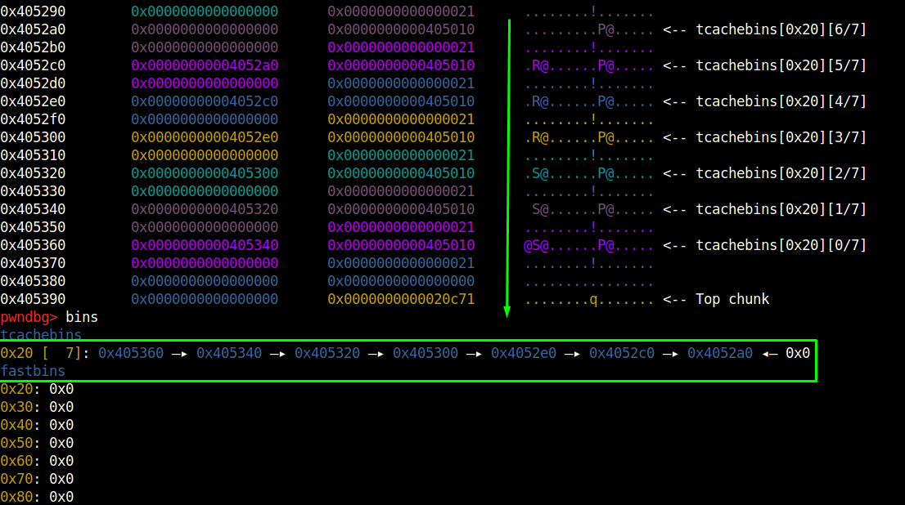

# Fastbin-Dub Double Free

The first section of code, will populate the Tcache, the Tcache only holds 7 chunks at time, the next freed at the same size chunk will goes to the fastbin.

```jsx
#include <stdio.h>
#include <stdlib.h>
#include <assert.h>

int main(void){
	setbuf(stdout, NULL);
	printf("Double-free with fastbin\n");

	printf("Loop to fill up tcache\n");
	void *ptr[8];
	for(int i=0; i<8; i++){
		ptr[i] = malloc(8);
	}
	// Tcache only holds 7 chunks at a time.
	for(int i=0; i<7; i++){
		free(ptr[i]);
	}

}
```

In this print we can look the seven freed chunks. 



What occurs if allocate three chunks, and free the same chunk two times? To it occurs, a chunk X need to be freed, after this a chunk Y need to be freed and the X freed again.


If it occurs the Tcache will have two references of the same freed chunk.


Freeing X:


Freeing  Y: Now the fastbins has two address of reference.


Freeing the X again we can see two references to the 0x405390 in freelist.


The goal here occurs when you will allocate more 3 chunks, the first will use the 0x405390, the second chunk will use the 0x4053b0 reference, and the last? Will use the 0x405390 again, because it is on freelist, two chunks pointing to the same address. 


```jsx
#include <stdio.h>
#include <stdlib.h>
#include <assert.h>

int main(void){
	printf("Double-free with fastbin\n");

	//Loop to fill up tcache
	void *ptr[8];
	for(int i=0; i<8; i++){
		ptr[i] = malloc(8);
	}
	// Tcache only holds 7 chunks at a time.
	for(int i=0; i<7; i++){
		free(ptr[i]);
	}

	// calloc fill up the allocated memory with zeros.
	// calloc(number elements, element size);
	int *x = calloc(1,8);
	int *y = calloc(1,8);
	int *z = calloc(1,8);
	

	printf("Chunk x at [%p]\n",x);
	printf("Chunk y at [%p]\n",y);
	printf("Chunk z at [%p]\n",z);

	printf("\nFreeing x...\n");
	free(x);
	printf("Freeing y...\n");
	free(y);

	// When a chunk is freed, it goes to the top of the freelist, so, the chunk on top now is the chunk Y.
	printf("\nReference X: %p\n",x);
	printf("Reference Y: %p\n",y);

	printf("Freeing x again...");
    free(x);	

	printf("\n\nCurrent free list:\n %p\n %p\n %p\n",x,y,x);
	// Test
		
	x = calloc(1,8);
	y = calloc(1,8);
	z = calloc(1,8);
	printf("After allocate new chunks, a chunk z will be assigned to the same address of x\n");
	printf("chunk x: %p\n",x);
	printf("chunk y: %p\n",y);
	printf("chunk z: %p\n",z);	
	
}
```


Reference: https://github.com/shellphish/how2heap